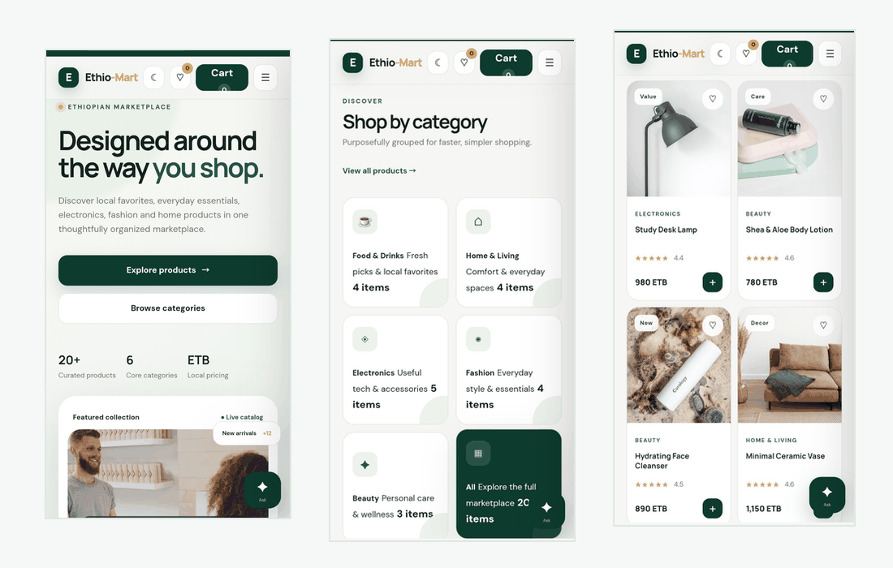
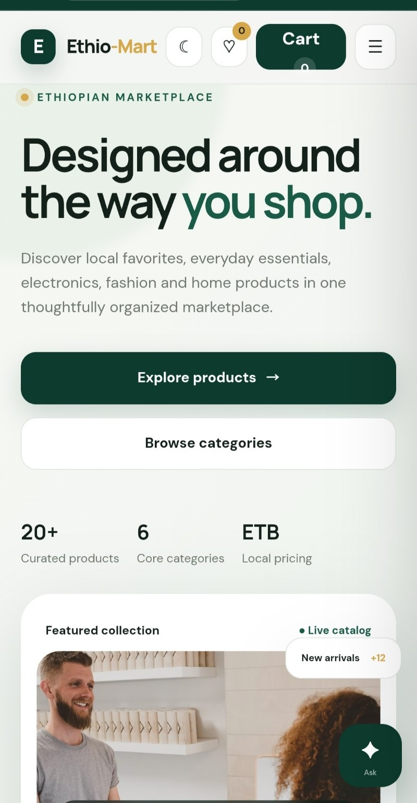
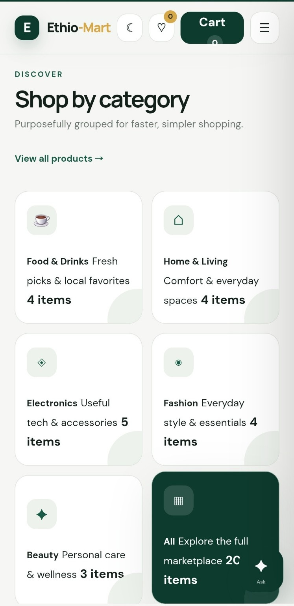
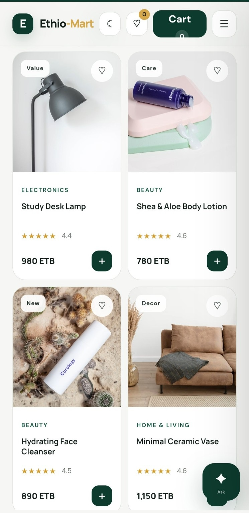

# 🛒 Ethio-Mart

<div align="center">



### 🇪🇹 Modern Ethiopian E-Commerce Experience

A modern, responsive e-commerce interface designed around the way people shop.

[](https://graviton25.github.io/Ethio-Mart/)
[](https://github.com/Graviton25/Ethio-Mart)

</div>

---

## 🌟 Overview

Ethio-Mart is a modern e-commerce website designed to provide a clean, organized, and enjoyable online shopping experience with an Ethiopian-focused context.

The interface brings everyday products into one marketplace, allowing users to discover products, browse categories, search the catalog, save favorites, manage a shopping cart, and explore a simple checkout experience.

🇪🇹 Product prices are presented in **Ethiopian Birr (ETB)**, while the responsive layout is designed to work smoothly across mobile, tablet, and desktop screens.

✨ The project focuses on **responsive UI design, product organization, interactive shopping features, visual hierarchy, and a smooth user experience**.

## 🏠 Homepage

The homepage introduces the marketplace with a clear visual hierarchy, featured collections, promotional content, product discovery actions, and quick access to the main shopping areas.

<div align="center">



</div>

## 🗂️ Categories

The category section organizes the marketplace into focused shopping areas, making it easier for users to discover products based on their interests.

<div align="center">



</div>

## 🛍️ Products

The product catalog presents products with images, categories, ratings, prices in ETB, favorite controls, and quick-add actions.

<div align="center">



</div>

## ✨ Features

- 🛍️ **Product Catalog** — Browse products across multiple categories.
- 🔎 **Search** — Find products quickly through the catalog.
- 🗂️ **Category Filtering** — Explore products by category.
- 💰 **ETB Pricing** — Display prices in Ethiopian Birr.
- ❤️ **Favorites** — Save products for later.
- 🛒 **Shopping Cart** — Add products and manage quantities.
- 💳 **Checkout Interface** — Review an order before checkout.
- 🏷️ **Promotional Sections** — Highlight featured products and offers.
- 🌙 **Dark Mode** — Switch between light and dark themes.
- 📱 **Responsive Design** — Adapted for mobile, tablet, and desktop screens.
- 🔔 **Toast Notifications** — Provide feedback for user actions.
- ⚡ **Interactive UI** — Smooth controls, modals, navigation, and product interactions.
- 🤖 **Shopping Assistant UI** — A dedicated assistant entry point for future smart shopping features.

## 🎞️ Animated Showcase

The animated showcase uses the actual Ethio-Mart screenshots with subtle floating motion to create a more dynamic GitHub presentation.

✨ The effect keeps the screenshots readable while giving the README a polished, modern feel.

## 🛠️ Tech Stack

- 🌐 **HTML5** — Semantic website structure
- 🎨 **CSS3** — Responsive layouts, animations, themes, and visual styling
- ⚡ **JavaScript** — Interactive functionality and dynamic UI behavior
- 📱 **Responsive Web Design** — Support for different screen sizes

## 📁 Project Structure

```text
Ethio-Mart/
├── 📂 assets/
│   ├── 🖼️ homepage-mobile.jpg
│   ├── 🖼️ categories-mobile.jpg
│   ├── 🖼️ products-mobile.jpg
│   └── 🎞️ ethio-mart-showcase.gif
├── 🌐 index.html
├── 🎨 style.css
├── ⚡ script.js
├── 📖 README.md
└── 🚫 .gitignore
```

## 💻 Run Locally

Clone the repository:

```bash
git clone https://github.com/Graviton25/Ethio-Mart.git
cd Ethio-Mart
```

Then open `index.html` in your browser.

For development, you can also open the project in **VS Code** and use **Live Server**.

⚡ No dependencies or build process are required for the frontend version.

## 🌐 Live Demo

Explore Ethio-Mart directly in your browser:

👉 **[Open Ethio-Mart Live Demo](https://graviton25.github.io/Ethio-Mart/)**

🛒 Explore categories, browse products, search the catalog, manage favorites and try the shopping cart.

## 🚀 Future Development

Ethio-Mart can be expanded into a complete full-stack e-commerce platform. Possible future improvements include:

- 🔐 **User Authentication** — Registration, login, and account management.
- 🗄️ **Backend & Database** — Store users, products, carts, and orders securely.
- 💳 **Payment Integration** — Connect secure Ethiopian and international payment services.
- 📦 **Order Management** — Create and track customer orders.
- 🚚 **Delivery Integration** — Connect delivery services and provide delivery updates.
- 🗺️ **Location & Maps** — Support delivery addresses and location selection.
- 🤖 **AI Shopping Assistant** — Help users discover products and answer shopping questions.
- 👨‍💼 **Admin Dashboard** — Manage products, inventory, customers, and orders.
- 🔔 **Real-Time Notifications** — Provide updates about orders and promotions.
- 📱 **Mobile Application** — Extend the platform to Android and iOS.
- 🌍 **Multi-Language Support** — Make the marketplace accessible to more users.

## ⚠️ Disclaimer

Ethio-Mart is a **frontend portfolio and learning project** created for educational and development purposes.

🛒 It is not currently connected to a real e-commerce backend and does not process real payments or real orders.

🔐 A production version would require secure authentication, backend infrastructure, database protection, payment integration, order management, inventory systems, and appropriate security measures.

## 👨‍💻 Author

**Nathnael Andualem**

🎓 Civil Engineering Student @ AASTU  
💻 Aspiring Software Developer  
🌍 Addis Ababa, Ethiopia

### 🔗 Connect

- 🐙 **GitHub:** [@Graviton25](https://github.com/Graviton25)

---

⭐ If you find Ethio-Mart interesting, feel free to explore the code and follow the project.
